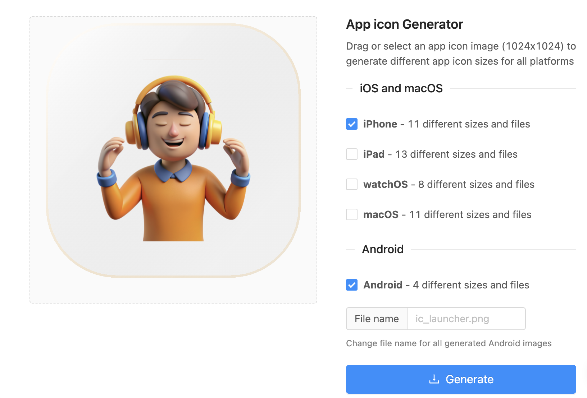
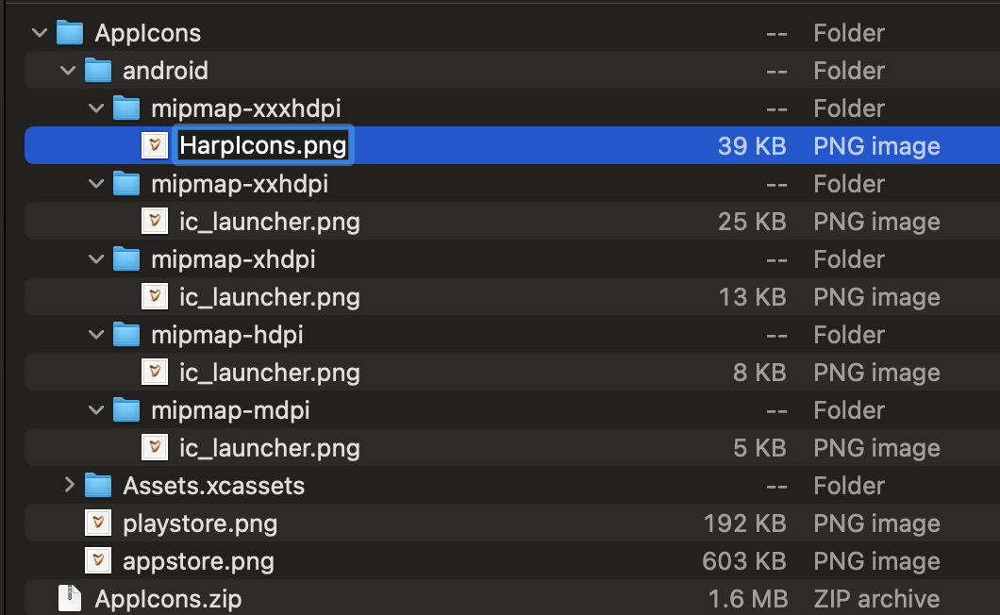
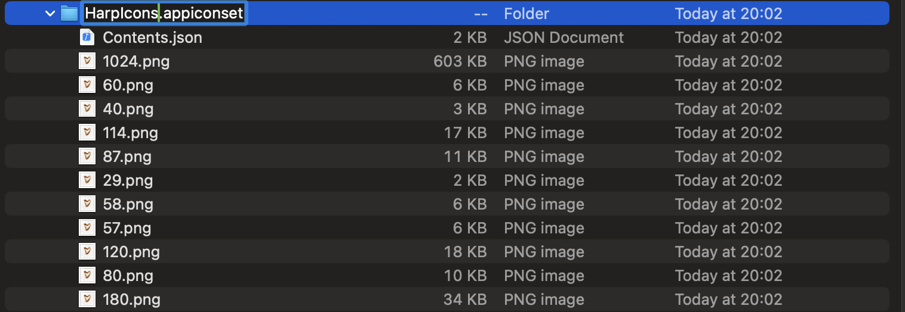
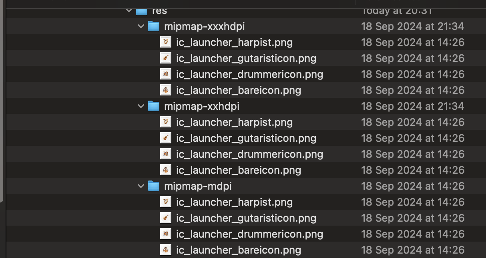
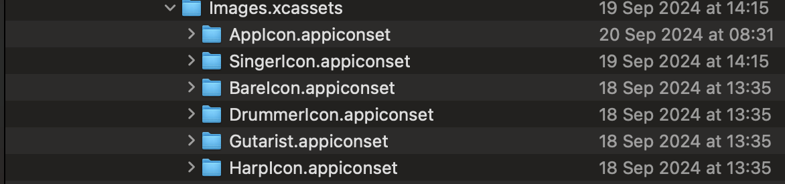
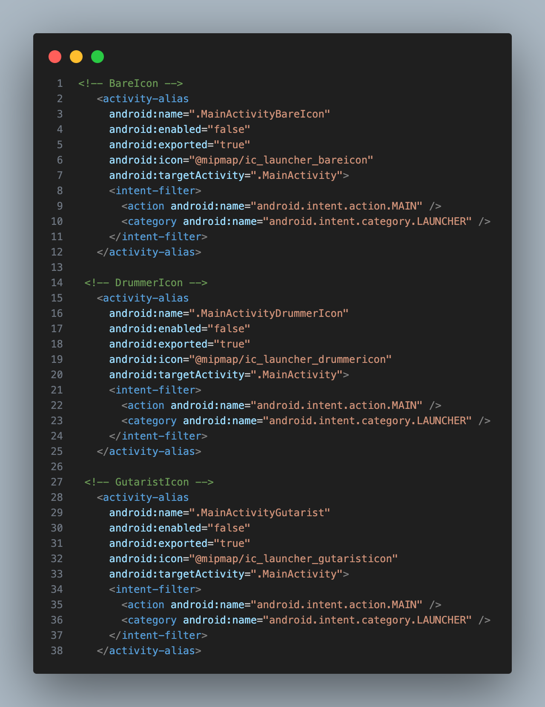
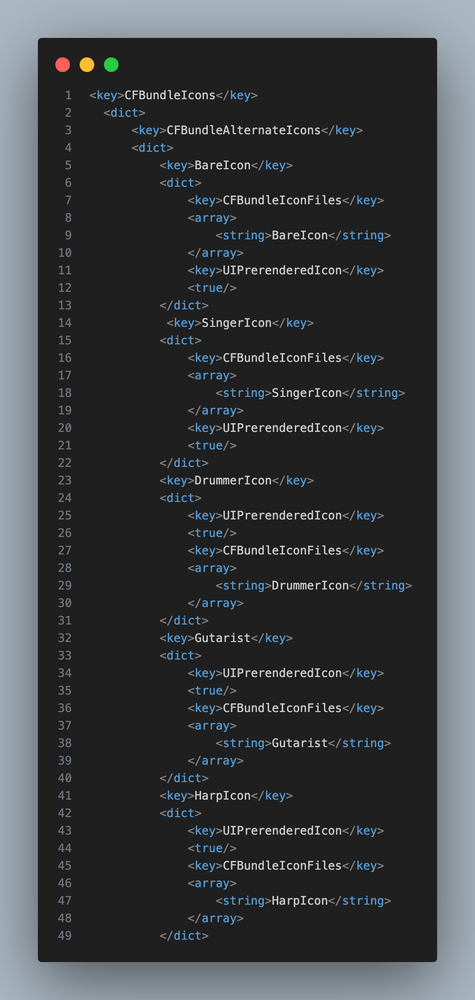

# React Native Dynamic App Icons

## Overview

This repository demonstrates a practical implementation of dynamic app icon changing in React Native, utilizing the `react-native-change-icon` library. It serves as a guide and example for developers looking to incorporate icon-switching functionality into their iOS and Android applications.

## Project Highlights

- **Practical Implementation**: Shows how to integrate and use the react-native-change-icon library in a real-world scenario.

- **Cross-Platform Demo**: Includes examples for both iOS and Android platforms.

- **Step-by-Step Guide**: Provides a clear walkthrough of the implementation process.

- **Best Practices**: Demonstrates recommended approaches for dynamic icon changing in React Native apps.

## Benefits of Dynamic App Icons

- **Enhanced User Experience**: Allows for a customizable and fresh app appearance.

- **Increased Engagement**: Can be used to highlight new features, events, or campaigns.

- **Seasonal Adaptability**: Demonstrates how to update the app's look for holidays or special occasions.

- **Marketing Tool**: Shows potential for A/B testing different icon designs.

## Installation

1. Install `react-native-change-icon` into your react native project using
   `yarn add react-native-change-icon` or `npm i react-native-change-icon`

2. Generate your AppIcons using [AppIconGenerator](https://www.appicon.co/)

   - Sample Icons are in the `./images` folder import into the app icon generator and generate app icons for iPhone and Android( you can create for all operating systems)
     

   ### `Android`

   - Open generated zip folder, navigate to android folder and rename all icons to desired name
     </br>

   ### `ios`

   - Open the generated zip folder, navigate to ios folder and rename the `AppIcon.appiconset` to desired icon name
     

   - Edit Contents.json and change the `Assets.xcassets/AppIcon.appiconset` to new Icon name e.g. `Images.xcassets/HarpIcons.appiconset`

   **REPEAT ABOVE STEPS FOR ALL OTHER ICONS**

   `Android`: Drag all of the mipmap folders into android/app/src/main/res/
   

   `ios` : Drag all of the .appiconset folders into ios/<app-name>/Images.xcassets
   

   ## Environment Setup

   ### `Android`

   1. Add an alias for each of your new icons within the AndroidManifest.xml (within <application>).

      - Make sure these have the properties as shown below.
      - Create an alias for .MainActivityDefault as well but for this, set android:enabled="true".
      - For the name prefix it .MainActivity... followed by the name you will use to reference your icon. e.g. for our HarpIcons icon we will use .MainActivityHarpIcons

        

   ### `ios`

   1. At the bottom of your Info.plist insert a key for CFBundleIcons.
   2. Within this dictionary add another key for CFBundleAlternateIcons
   3. In XCode, in your app's General settings, under App Icons and Launch Screen, set "App Icon" to Default and check the "Include all app icon assets" checkbox below.
   4. Finally then within this dictionary you can add in the keys for you new icons

      - The key is the name you will reference from within code.
      - Set the first array item to the name of the .appiconset we created earlier.

     

## Usage

To use the changeIcon functionality, simply import it along with any other required methods from the library:

```typescript
import { changeIcon, getIcon, resetIcon } from 'react-native-change-icon';

// Pass the name of icon to be enabled
changeIcon('HarpIcons');
```

That's it! You can now seamlessly change icons based on your implementation logic.

## Troubleshooting and Common Issues

When implementing react-native-change-icon, especially in an Expo-managed project, you might encounter some challenges. Here are solutions to common problems:

1. Accessing Native iOS and Android Files in Expo
   **Problem**: Expo-managed projects don't have direct access to native iOS and Android files by default.
   **Solution**: Use the prebuild command to generate native projects:

```bash
expo prebuild
```

This command creates ios and android folders in your project, allowing you to modify native files as needed for icon changing functionality.
Note: After running prebuild, your project becomes an Expo "bare" workflow project. Be sure to commit these changes to version control.

2. Testing Production Builds on iOS
   **Problem**: Testing icon changing in a production environment on iOS requires a release build.
   **Solution**: Use the following command to create and run a release build on an iOS device:

```bash
npx expo run:ios --configuration Release --device
```

This command:
Builds your app in release configuration
Installs it on a connected iOS device
Allows you to test icon changing functionality in a production-like environment

3. Testing Production Builds on Android
   **Problem**: Testing icon changing in a production environment on Android requires a release APK.
   **Solution**: Follow these steps to create and test a release APK

- Navigate to the android directory in your project:

```bash
cd android
```

- Run the Gradle task to assemble the release APK:

```bash
./gradlew assembleRelease
```

- The APK will be generated in `android/app/build/outputs/apk/release/app-release.apk`
  Install the APK on your Android device or emulator to test the icon changing functionality in a production environment.
